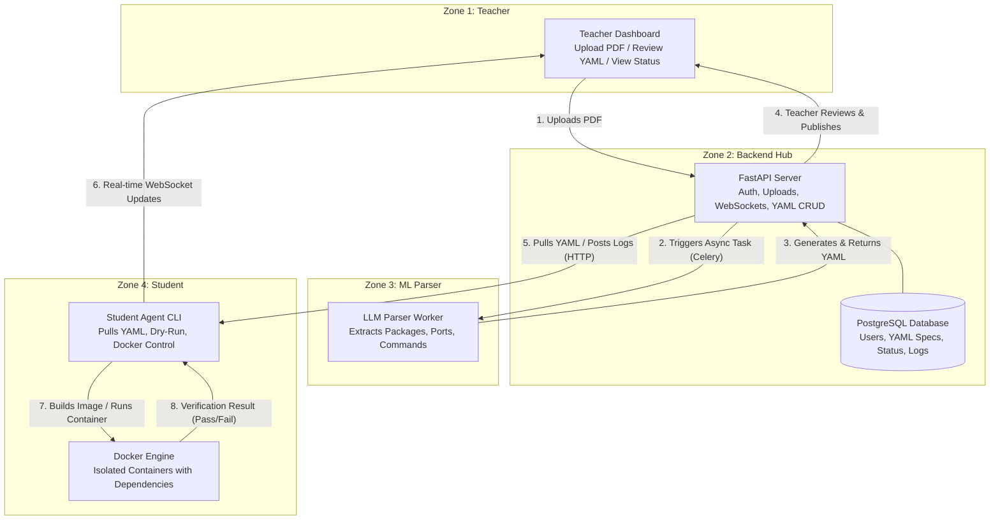
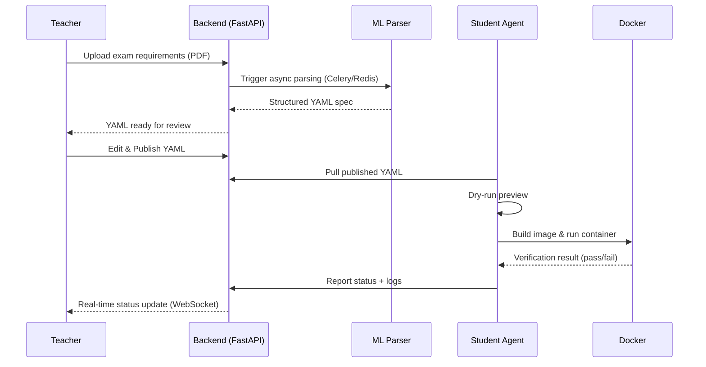

# ExamEnv — Infrastructure-as-Code for Exams

> **One-click, reproducible exam environments — from a teacher's PDF to a verified student container in minutes.**

ExamEnv is a platform that converts a teacher's exam/lab requirement document into a structured, machine-readable specification and automates the provisioning of isolated, reproducible student environments — eliminating the hours typically lost to manual setup before labs and exams.

---

## Table of Contents

- [Problem Statement](#problem-statement)
- [Why ExamEnv Stands Out](#why-examenv-stands-out)
- [System Architecture](#system-architecture)
- [End-to-End Data Flow](#end-to-end-data-flow)
  - [Phase 1: Teacher Upload & AI Parsing](#phase-1-teacher-upload--ai-parsing)
  - [Phase 2: Student Environment Provisioning](#phase-2-student-environment-provisioning)
  - [Phase 3: Real-Time Teacher Monitoring](#phase-3-real-time-teacher-monitoring)
- [Core Features](#core-features)
- [New / Upcoming Features](#new--upcoming-features)
- [Tech Stack](#tech-stack)
- [Repository Structure](#repository-structure)
- [Getting Started](#getting-started)
- [Why This Matters — Value to Each Audience](#why-this-matters--value-to-each-audience)
- [Team & Contributions](#team--contributions)
- [Roadmap](#roadmap)
- [License](#license)

---

## Problem Statement

Setting up the right software environment before a lab or exam is a recurring source of wasted time and frustration:

- Students spend the first 20–30 minutes of a session installing packages instead of working on the actual task.
- Every student's machine is slightly different, so "it works on my machine" failures are common and hard to debug live.
- Teachers have no visibility into who is actually ready to start until problems surface mid-exam.
- Manually writing setup instructions for every course, every term, doesn't scale.

ExamEnv turns environment setup into **Infrastructure-as-Code**: define it once, generate it automatically, and let every student provision an identical, verified environment with a single command.

## Why ExamEnv Stands Out

- **Solves a real, everyday pain point** — environment setup wastes hours across labs and exams every term.
- **Modern DevOps patterns applied to education** — Infrastructure-as-Code, containerization, and LLM-based parsing, not just a static checklist.
- **Truly end-to-end** — teacher upload → automated YAML generation → student provisioning → automated verification → live teacher dashboard, all connected.
- **Human-in-the-loop AI** — the AI drafts the environment spec, but the teacher always reviews and approves it before students ever see it.

---

## System Architecture

ExamEnv is organized into four cooperating zones:



> If your Markdown viewer doesn't render Mermaid, see `docs/architecture.png` for the static diagram export.

| Zone | Component | Responsibility |
|---|---|---|
| Zone 1 | Teacher Dashboard | Upload requirement PDFs, review/edit generated YAML, publish specs, view live status |
| Zone 2 | Backend Hub (FastAPI + PostgreSQL + Celery/Redis) | Auth, file storage, async job orchestration, YAML CRUD, WebSocket status broadcasting |
| Zone 3 | ML Parser | LLM-based extraction of packages, versions, env vars, ports, datasets, and setup commands from PDFs |
| Zone 4 | Student Agent (CLI) + Docker Engine | Fetches published specs, dry-run preview, builds/runs isolated containers, runs verification |

---

## End-to-End Data Flow

### Phase 1: Teacher Upload & AI Parsing

| Step | Action | Component Involved |
|---|---|---|
| 1 | Teacher uploads a PDF (exam requirements) via the web dashboard. | Teacher → Backend |
| 2 | Backend stores the file (S3 or local disk) and asynchronously triggers the ML Parser via Celery + Redis, so the teacher isn't blocked waiting. | Backend |
| 3 | ML Parser (AI) reads the PDF and extracts structured data: packages, versions, environment variables, ports, datasets, and setup commands. | ML Parser |
| 4 | Parser converts the extracted data into a clean YAML file — our Infrastructure-as-Code spec. | ML Parser → Backend |
| 5 | Teacher reviews the generated YAML on the dashboard, makes manual edits if the AI made mistakes, and clicks **Publish**. | Teacher → Backend |

### Phase 2: Student Environment Provisioning

| Step | Action | Component Involved |
|---|---|---|
| 6 | Student logs into their terminal and runs the Student Agent CLI. The agent fetches the list of available environments and pulls the published YAML for their exam. | Student Agent → Backend |
| 7 | Agent performs a **Dry-Run** — shows a clear preview of what will be installed/changed (e.g., *"Will install Python 3.10, expose port 8000"*). Student must confirm with "Yes" to proceed. | Student Agent |
| 8 | Agent builds a Docker image from the YAML spec (or uses a pre-built base image and installs packages on top). | Student Agent → Docker |
| 9 | Agent runs the Docker container with the specified exposed ports and volume mounts (for datasets/code). | Student Agent → Docker |
| 10 | A verification script runs inside the container — checks all dependencies (e.g., `python --version`, `pip list`, imports). | Docker → Student Agent |
| 11 | Agent collects the verification logs and reports the final status back to the Backend via API. | Student Agent → Backend |

### Phase 3: Real-Time Teacher Monitoring

| Step | Action | Component Involved |
|---|---|---|
| 12 | Teacher opens the dashboard and sees a real-time status for every student: **Ready** (green), **Failed** (red), or **Not Started** (grey). Updates happen automatically via WebSockets. | Backend → Teacher Dashboard |
| 13 | If a student's status shows "Failed," the teacher can click their row to view the exact error logs (e.g., *"Port 5432 already in use"*) and help them debug. | Teacher Dashboard |

### Flow at a Glance



---

## Core Features

- 📄 **PDF-to-IaC conversion** — upload a plain-language requirement document, get back a structured YAML spec.
- ✍️ **Human-reviewed AI output** — teachers can edit AI-generated specs before publishing; nothing reaches students unreviewed.
- 👀 **Dry-run previews** — students see exactly what will change before anything is installed or run.
- 📦 **Containerized, reproducible environments** — every student gets an identical, isolated Docker environment.
- ✅ **Automated verification** — dependency checks run automatically inside the container, no manual troubleshooting needed to confirm readiness.
- 📊 **Real-time teacher dashboard** — live Ready / Failed / Not Started status for the whole class via WebSockets.
- 🐞 **Guided debugging** — teachers can drill into a failed student's exact error log instead of guessing.

## New / Upcoming Features

Beyond the core end-to-end flow above, the following are planned as the next layer of ExamEnv:

- **Template Library** — a growing set of pre-built, verified YAML templates for common course types (Python/Data Science, Web Dev, Databases, ML) so teachers can start from a known-good baseline instead of a blank AI parse.
- **Multi-format requirement ingestion** — accept plain text or slide-based requirement docs in addition to PDF.
- **Role-based access control** — distinct permission levels for Teaching Assistants vs. Lead Instructors vs. Admins.
- **Environment expiry & auto-cleanup** — automatically tear down containers after an exam window closes, to save local resources.
- **Analytics dashboard** — aggregate, term-over-term data on the most common failure reasons, to help institutions fix recurring environment issues at the source.
- **Offline / air-gapped mode** — support pre-downloaded base images for exam rooms without reliable internet access.
- **Notification system** — email/Slack alerts to teachers when a significant fraction of a class is stuck in "Failed" status.

---

## Tech Stack

| Layer | Technology |
|---|---|
| Backend API | FastAPI (Python) |
| Database | PostgreSQL |
| Async Task Queue | Celery + Redis |
| AI / Parsing | LLM-based document parser |
| Environment Runtime | Docker |
| Real-Time Updates | WebSockets |
| Student Tooling | Python CLI Agent |
| File Storage | AWS S3 / local disk |

---

## Repository Structure

```
examenv/
├── backend/
│   ├── app/
│   │   ├── api/              # FastAPI route handlers (auth, upload, yaml, status)
│   │   ├── models/           # PostgreSQL models (Users, Specs, Status, Logs)
│   │   ├── tasks/            # Celery tasks (async PDF parsing)
│   │   └── websockets/       # Real-time status broadcasting
│   └── requirements.txt
├── ml-parser/
│   ├── parser/                # LLM prompt logic, PDF text extraction
│   └── templates/             # Template Library (pre-built YAML specs + verification scripts)
├── student-agent/
│   ├── agent/                 # CLI commands: pull, dry-run, provision, report
│   └── docker/                # Dockerfile generation & container lifecycle management
├── frontend/
│   └── dashboard/             # Teacher dashboard (upload, review, live status grid)
├── docs/
│   └── architecture.png       # Static export of the architecture diagram
└── README.md
```

---

## Getting Started

> Update the commands below to match your actual setup scripts once implemented.

```bash
# 1. Clone the repository
git clone https://github.com/<your-org>/examenv.git
cd examenv

# 2. Start the backend (FastAPI + PostgreSQL + Redis)
cd backend
pip install -r requirements.txt
uvicorn app.main:app --reload

# 3. Start the Celery worker (for async PDF parsing)
celery -A app.tasks worker --loglevel=info

# 4. Install and run the Student Agent CLI
cd student-agent
pip install -e .
examenv-agent pull <exam-id>
examenv-agent provision
```

**Prerequisites:** Docker Engine installed and running on the student's machine, Python 3.10+, and network access to the ExamEnv backend.

---

## Why This Matters — Value to Each Audience

**For Students**
- No more losing exam/lab time to setup errors — a single command gets you a verified, working environment.
- The dry-run preview means you always know what's about to change before it happens.
- Clear pass/fail verification means you know you're ready *before* the exam starts, not during it.

**For Teachers**
- Write requirements in plain language (a PDF) instead of hand-crafting setup scripts for every course.
- Full visibility into class-wide readiness in real time, instead of finding out about problems mid-exam.
- Faster, more targeted debugging — jump straight to a student's actual error log instead of troubleshooting blind.

**For Institutions**
- Reduces the support burden on TAs and lab staff during high-stakes exam windows.
- Standardizes environments across sections/instructors, improving grading fairness and reproducibility.
- The Template Library and analytics create a reusable, continuously improving knowledge base across terms.

---

## Team & Contributions

| Role | Designation | Responsibilities |
|---|---|---|
| Member 1 | ML / Parser Engineer | Builds the LLM parser; writes prompts to extract packages/ports from PDFs; creates the Template Library (pre-built YAMLs) and verification scripts. |
| Member 2 | Backend Developer | Builds the FastAPI server; creates APIs for login, file upload, YAML review, and receiving agent reports; sets up PostgreSQL and Celery/Redis. |
| Member 3 | DevOps / Agent Developer | Builds the Student Agent (Python CLI); integrates with Docker; writes Dockerfiles for environments; sets up CI/CD and deploys the system on a cloud VM. |

---

## Roadmap

- [x] Define end-to-end architecture and data flow
- [ ] Backend: auth, upload, YAML CRUD, WebSocket status
- [ ] ML Parser: PDF → YAML extraction pipeline
- [ ] Student Agent: pull, dry-run, provision, verify, report
- [ ] Teacher Dashboard: upload UI, YAML review/edit, live status grid
- [ ] Template Library v1 (3–5 common course templates)
- [ ] Analytics dashboard for recurring failure patterns
- [ ] Offline/air-gapped provisioning mode

---

## License

Add your chosen license here (e.g., MIT, Apache-2.0) before publishing publicly.
